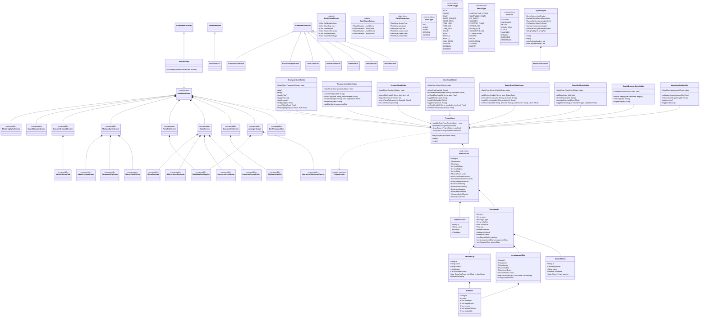

# Mobile DAW Architecture & Class Diagram Map

This document is the **living map of the codebase**, maintained and kept continuously up to date as each component and class is implemented.

```mermaid
classDiagram
    %% ==========================================
    %% INHERITANCE / HIERARCHY
    %% ==========================================
    ComponentActivity <|-- MainActivity
    RoomDatabase <|-- DawDatabase

    AudioEffectModule <|-- ReverbModule
    AudioEffectModule <|-- DelayModule
    AudioEffectModule <|-- FilterModule
    AudioEffectModule <|-- DistortionModule
    AudioEffectModule <|-- ChorusModule
    AudioEffectModule <|-- ParametricEqModule
    AudioEffectModule <|-- CompressorModule

    %% ==========================================
    %% APP ENTRY POINT & SCREENS (EARTH.DESIGN)
    %% ==========================================
    class MainActivity {
        +onCreate(savedInstanceState: Bundle)
    }

    class MainDawScreen {
        <<composable>>
    }

    class ArrangerScreen {
        <<composable>>
    }

    class SessionViewScreen {
        <<composable>>
    }

    class MixerScreen {
        <<composable>>
    }

    class PianoRollScreen {
        <<composable>>
    }

    class ModularSynthScreen {
        <<composable>>
    }

    class SamplerDrumLabScreen {
        <<composable>>
    }

    class SoundBrowserScreen {
        <<composable>>
    }

    class MasteringSuiteScreen {
        <<composable>>
    }

    %% ==========================================
    %% EARTH.DESIGN PRO-AUDIO COMPONENTS
    %% ==========================================
    class EarthTransportBar {
        <<composable>>
    }

    class MacroCutoffKnob {
        <<composable>>
    }

    class BiDirectionalPanKnob {
        <<composable>>
    }

    class MicroEncoder {
        <<composable>>
    }

    class PrecisionCrystalFader {
        <<composable>>
    }

    class StereoLedLevelMeter {
        <<composable>>
    }

    class SoloMuteArmToggles {
        <<composable>>
    }

    class ClipLauncherTile {
        <<composable>>
    }

    class VelocityDrumPad {
        <<composable>>
    }

    class InteractiveWaveformCanvas {
        <<composable>>
    }

    class ParametricEqGraph {
        <<composable>>
    }

    class AdsrEnvelopeGraph {
        <<composable>>
    }

    %% ==========================================
    %% UNIDIRECTIONAL DATA FLOW (UDF) STORE
    %% ==========================================
    class ProjectStore {
        -MutableStateFlow~ProjectState~ _state
        +StateFlow~ProjectState~ state
        -ArrayDeque~ProjectState~ undoStack
        -ArrayDeque~ProjectState~ redoStack
        +dispatch(ProjectAction action)
        +undo()
        +redo()
    }

    class ProjectState {
        <<data class>>
        +String id
        +String name
        +Float bpm
        +Int timeSigNum
        +Int timeSigDen
        +Int keyRoot
        +MusicalScale scale
        +List~TrackModel~ tracks
        +List~SessionScene~ scenes
        +Float masterVolumeDb
        +Boolean isPlaying
        +Boolean isRecording
        +Boolean isLooping
        +Float playheadBeat
        +String selectedTrackId
        +DawTab activeTab
    }

    class ProjectAction {
        <<sealed interface>>
    }

    %% ==========================================
    %% MODULAR UI STATE HOLDERS
    %% ==========================================
    class TransportStateHolder {
        +StateFlow~TransportUiState~ state
        +play()
        +stop()
        +togglePlay()
        +toggleRecord()
        +toggleLoop()
        +setBpm(bpm: Float)
        +seekToBeat(beat: Float)
        +setLoopRegion(start: Float, end: Float)
    }

    class ArrangementStateHolder {
        +StateFlow~ArrangementUiState~ state
        +selectTrack(trackId: String)
        +moveClip(clipId: String, newStartBeat: Float)
        +resizeClip(clipId: String, newLengthBeats: Float)
        +deleteClip(clipId: String)
        +addClip(clip: ArrangementClip)
    }

    class SessionStateHolder {
        +StateFlow~SessionUiState~ state
        +triggerClip(trackId: String, slotIndex: Int)
        +triggerScene(sceneIndex: Int)
        +returnTrackToArrangement(trackId: String)
        +returnAllToArrangement()
    }

    class MixerStateHolder {
        +StateFlow~MixerUiState~ state
        +selectTrack(trackId: String)
        +setTrackVolume(trackId: String, volumeDb: Float)
        +setTrackPan(trackId: String, pan: Float)
        +toggleMute(trackId: String)
        +toggleSolo(trackId: String)
        +toggleArm(trackId: String)
        +setSend(trackId: String, sendIndex: Int, level: Float)
        +setMasterVolume(volumeDb: Float)
    }

    class DeviceRackStateHolder {
        +StateFlow~DeviceRackUiState~ state
        +addDevice(trackId: String, type: DeviceType)
        +removeDevice(trackId: String, deviceId: String)
        +toggleDevice(trackId: String, deviceId: String)
        +setParam(trackId: String, deviceId: String, paramName: String, value: Float)
    }

    class PianoRollStateHolder {
        +StateFlow~PianoRollUiState~ state
        +addNote(note: MidiNote)
        +deleteNote(noteId: String)
        +quantizeNotes(gridBeat: Float)
        +toggleDrumStep(pad: DrumPadType, stepBeat: Float)
    }

    class SoundBrowserStateHolder {
        +StateFlow~BrowserUiState~ state
        +selectCategory(cat: BrowserCategory)
        +search(query: String)
        +toggleTag(tag: String)
    }

    class MasteringStateHolder {
        +StateFlow~MasteringUiState~ state
        +setMasterVolume(volumeDb: Float)
        +setLimiterCeiling(ceilingDb: Float)
        +toggleLimiter()
        +toggleMultiband()
    }

    %% ==========================================
    %% DESIGN SYSTEM (EARTH.DESIGN)
    %% ==========================================
    class EarthColorTokens {
        <<object>>
        +Color BgObsidianDeep
        +Color GlassEspresso
        +Color EarthAmber
        +Color AutumnTerracotta
        +Color NatureEmerald
        +Color NatureMossSage
    }

    class EarthGlassTokens {
        <<object>>
        +GlassElevation Level1Dock
        +GlassElevation Level2Panel
        +GlassElevation Level3Device
        +GlassElevation Level4Modal
    }

    class EarthTypography {
        <<data class>>
        +TextStyle displayTime
        +TextStyle bpmValue
        +TextStyle trackTitle
        +TextStyle sectionLabel
        +TextStyle paramLabel
        +TextStyle paramValue
    }

    %% ==========================================
    %% CORE DOMAIN MODELS
    %% ==========================================
    class TrackModel {
        +String id
        +String name
        +TrackType type
        +String colorHex
        +Float volumeDb
        +Float pan
        +Boolean isMuted
        +Boolean isSoloed
        +Boolean isArmed
        +List~DeviceModel~ devices
        +List~ArrangementClip~ arrangementClips
        +List~SessionClip~ sessionClips
    }

    class TrackType {
        <<enumeration>>
        MIDI
        AUDIO
        DRUM
        RETURN
        MASTER
    }

    class ArrangementClip {
        +String id
        +String name
        +String trackId
        +Float startBeat
        +Float lengthBeats
        +List~MidiNote~ notes
        +Map~DrumPadType, List~Float~~ drumSteps
        +String audioFilePath
    }

    class SessionClip {
        +String id
        +String name
        +String trackId
        +Int slotIndex
        +List~MidiNote~ notes
        +Map~DrumPadType, List~Float~~ drumSteps
        +Boolean isPlaying
    }

    class SessionScene {
        +String id
        +String name
        +Int index
        +Float bpm
    }

    class MidiNote {
        +String id
        +Int pitch
        +Float startBeat
        +Float lengthBeats
        +Float velocity
        +Float releaseVelocity
        +Float probability
    }

    class DrumPadType {
        <<enumeration>>
        KICK
        SNARE
        CLAP
        HIHAT_CLOSED
        HIHAT_OPEN
        TOM_LOW
        TOM_MID
        TOM_HIGH
        CRASH
        RIDE
        PERC_1
        PERC_2
        SUB_BOOM
        SHAKER
        COWBELL
        RIMSHOT
    }

    class DeviceModel {
        +String id
        +DeviceType type
        +String name
        +Boolean isEnabled
        +Map~String, Float~ params
    }

    class DeviceType {
        <<enumeration>>
        SUBTRACTIVE_SYNTH
        WAVETABLE_SYNTH
        FM_SYNTH
        SAMPLER
        ELECTRIC_PIANO
        STRING_PAD
        DRUM_RACK
        PARAMETRIC_EQ
        COMPRESSOR
        REVERB
        DELAY
        DISTORTION
        CHORUS
        LIMITER
    }

    class DawTab {
        <<enumeration>>
        SESSION
        ARRANGER
        MIXER
        PIANO_ROLL
        SYNTH
        SAMPLER
        DRUMS
        BROWSER
        MASTERING
    }

    %% ==========================================
    %% AUDIO ENGINE & CORE SYNTHESIS
    %% ==========================================
    class SynthEngine {
        +DrumEngine drumEngine
        +MasterEffectsRack effectsRack
        +WavetableSynth wavetableSynth
        +FmOperatorSynth fmSynth
        +SamplerInstrument sampler
        +ElectricPianoSynth electricPiano
        +StringPadSynth stringPad
        +start()
        +stop()
        +noteOn(noteNumber: Int)
        +noteOff(noteNumber: Int)
    }

    %% ==========================================
    %% DEPENDENCIES & RELATIONSHIPS
    %% ==========================================
    MainActivity ..> MainDawScreen
    MainDawScreen ..> ProjectStore
    MainDawScreen *-- EarthTransportBar
    MainDawScreen *-- ArrangerScreen
    MainDawScreen *-- SessionViewScreen
    MainDawScreen *-- MixerScreen
    MainDawScreen *-- PianoRollScreen
    MainDawScreen *-- ModularSynthScreen
    MainDawScreen *-- SamplerDrumLabScreen
    MainDawScreen *-- SoundBrowserScreen
    MainDawScreen *-- MasteringSuiteScreen

    ArrangerScreen *-- InteractiveWaveformCanvas
    ArrangerScreen *-- SoloMuteArmToggles
    SessionViewScreen *-- ClipLauncherTile
    MixerScreen *-- PrecisionCrystalFader
    MixerScreen *-- StereoLedLevelMeter
    MixerScreen *-- BiDirectionalPanKnob
    MixerScreen *-- MicroEncoder
    PianoRollScreen *-- SoloMuteArmToggles
    ModularSynthScreen *-- MacroCutoffKnob
    ModularSynthScreen *-- ParametricEqGraph
    ModularSynthScreen *-- AdsrEnvelopeGraph
    SamplerDrumLabScreen *-- VelocityDrumPad

    ProjectStore *-- ProjectState
    ProjectStore ..> ProjectAction
    ProjectState *-- TrackModel
    ProjectState *-- SessionScene
    TrackModel *-- DeviceModel
    TrackModel *-- ArrangementClip
    TrackModel *-- SessionClip
    ArrangementClip *-- MidiNote
    SessionClip *-- MidiNote

    TransportStateHolder --> ProjectStore
    ArrangementStateHolder --> ProjectStore
    SessionStateHolder --> ProjectStore
    MixerStateHolder --> ProjectStore
    DeviceRackStateHolder --> ProjectStore
    PianoRollStateHolder --> ProjectStore
    SoundBrowserStateHolder --> ProjectStore
    MasteringStateHolder --> ProjectStore

    SynthEngine *-- MasterEffectsRack
```
