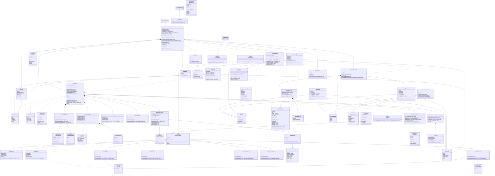

```mermaid
classDiagram
    %% ==========================================
    %% INHERITANCE / HIERARCHY
    %% ==========================================
    ComponentActivity <|-- MainActivity
    AndroidViewModel <|-- SynthViewModel
    RoomDatabase <|-- DawDatabase

    AudioEffectModule <|-- ReverbModule
    AudioEffectModule <|-- DelayModule
    AudioEffectModule <|-- FilterModule
    AudioEffectModule <|-- DistortionModule
    AudioEffectModule <|-- ChorusModule
    AudioEffectModule <|-- ParametricEqModule
    AudioEffectModule <|-- CompressorModule

    %% ==========================================
    %% APP ENTRY POINT
    %% ==========================================
    class MainActivity {
        +onCreate(savedInstanceState: Bundle)
    }

    %% ==========================================
    %% PRESENTATION LAYER (VIEWMODEL)
    %% ==========================================
    class SynthViewModel {
        -SynthEngine _engine
        -DawDatabase database
        -ProjectRepository projectRepository
        +StateFlow~List~ProjectEntity~~ allSavedProjects
        +StateFlow~DawTab~ currentTab
        +StateFlow~Boolean~ isPlaying
        +StateFlow~Float~ bpm
        +StateFlow~List~MidiNote~~ leadNotes
        +StateFlow~List~MidiNote~~ bassNotes
        +StateFlow~List~SessionScene~~ scenes
        +StateFlow~List~ArrangementTrack~~ arrangementTracks
        +loadProject(index: Int)
        +saveProject(name: String)
        +togglePlay()
        +noteOn(note: Int)
        +noteOff(note: Int)
        +triggerScene(sceneIndex: Int)
        +triggerClip(track: SessionTrackType, clipIndex: Int)
    }

    class DawTab {
        <<enumeration>>
        SESSION
        ARRANGER
        SYNTH
        SAMPLER
        PIANO_ROLL
        DRUMS
        MIXER
    }

    %% ==========================================
    %% AUDIO ENGINE & CORE SYNTHESIS
    %% ==========================================
    class SynthEngine {
        +DrumEngine drumEngine
        +MasterEffectsRack effectsRack
        +WavetableSynth wavetableSynth
        +FmOperatorSynth fmSynth
        +SamplerInstrument sampler
        +ElectricPianoSynth electricPiano
        +StringPadSynth stringPad
        +InstrumentType activeInstrument
        +start()
        +stop()
        +noteOn(noteNumber: Int)
        +noteOff(noteNumber: Int)
        +bassNoteOn(noteNumber: Int)
        +bassNoteOff(noteNumber: Int)
        +triggerDrum(type: DrumType, velocity: Float)
        +panic()
    }

    class Waveform {
        <<enumeration>>
        SINE
        SQUARE
        TRIANGLE
        SAWTOOTH
        NOISE
    }

    class LfoDestination {
        <<enumeration>>
        NONE
        VCO_PITCH
        VCF_CUTOFF
        VCA_VOLUME
        PAN
    }

    class FilterType {
        <<enumeration>>
        LOW_PASS
        HIGH_PASS
        BAND_PASS
    }

    class InstrumentType {
        <<enumeration>>
        ANALOG_SUB
        WAVETABLE
        FM_OPERATOR
        SAMPLER
        ELECTRIC_PIANO
        STRING_PAD
    }

    class SynthPatch {
        +String name
        +Waveform vco1Waveform
        +Waveform vco2Waveform
        +Waveform lfoWaveform
        +LfoDestination lfoDestination
        +FilterType filterType
        +applyToEngine(engine: SynthEngine)
    }

    %% ==========================================
    %% INSTRUMENTS & SYNTH GENERATORS
    %% ==========================================
    class WavetableSynth {
        +WavetableBank bank
        +Float tablePosition
        +WavetableWarpMode warpMode
        +renderSample(frequency: Float) Float
        +getWaveformVisual(resolution: Int) FloatArray
    }

    class WavetableBank {
        <<enumeration>>
        MODERN_ANALOG
        CYBER_FORMANT
        METALLIC_GLASS
        CHIPTUNE_8BIT
        ORGAN_HARMONICS
    }

    class WavetableWarpMode {
        <<enumeration>>
        NONE
        PWM
        SYNC
        BEND
        FM
    }

    class FmOperatorSynth {
        +FmAlgorithm algorithm
        +FmOperatorState opA
        +FmOperatorState opB
        +FmOperatorState opC
        +FmOperatorState opD
        +renderSample(baseFreq: Float, envGate: Float) Float
    }

    class FmAlgorithm {
        <<enumeration>>
        CASCADE_STACK
        DUAL_STACK
        PARALLEL_MOD
        ALL_PARALLEL
    }

    class FmOperatorState {
        +Float ratio
        +Float fineTune
        +Float level
        +Float feedback
    }

    class SamplerInstrument {
        +SamplerPlaybackMode mode
        +Int selectedPresetIndex
        +Float startPoint
        +Float endPoint
        +FloatArray sampleBuffer
        +triggerNoteOn(pitch: Int, velocity: Float)
        +triggerNoteOff(pitch: Int)
        +renderSample() Float
        +loadPreset(index: Int)
    }

    class SamplerPlaybackMode {
        <<enumeration>>
        CLASSIC
        ONE_SHOT
        SLICING
    }

    class SamplePreset {
        +String id
        +String name
        +Int rootPitch
        +SampleGeneratorType generatorType
    }

    class SampleGeneratorType {
        <<enumeration>>
        SUB_808
        RHODES_CHORD
        ACOUSTIC_SNARE
        VOCAL_CHANT
        GRAND_PIANO
        CYBER_PLUCK
        AMEN_BREAK
        VINYL_CRACKLE
    }

    class ElectricPianoSynth {
        +Float tineDecay
        +Float bellHarmonic
        +Float tremoloRate
        +renderSample(baseFreq: Float, envGate: Float) Float
    }

    class StringPadSynth {
        +Float chorusDepth
        +Float ensembleSpeed
        +renderSample(baseFreq: Float, envGate: Float) Float
    }

    class DrumEngine {
        +Map~DrumType, DrumVoice~ voices
        +trigger(type: DrumType, velocity: Float)
        +render(sampleRate: Int) Float
        +stopAll()
    }

    class DrumVoice {
        +DrumType type
        +Boolean isTriggered
        +Float velocity
        +trigger(vel: Float)
        +renderSample(sampleRate: Int) Float
    }

    class DrumType {
        <<enumeration>>
        KICK
        SNARE
        HIHAT_CLOSED
        HIHAT_OPEN
        CLAP
        TOM
    }

    %% ==========================================
    %% DSP AUDIO EFFECTS
    %% ==========================================
    class MasterEffectsRack {
        -List~AudioEffectModule~ modules
        +getModules() List~AudioEffectModule~
        +addModule(type: EffectType) AudioEffectModule
        +removeModule(id: String)
        +moveModule(fromIndex: Int, toIndex: Int)
        +process(inL: Float, inR: Float) Pair~Float, Float~
    }

    class AudioEffectModule {
        <<abstract>>
        +String id
        +EffectType type
        +Boolean isEnabled
        +processStereo(inL: Float, inR: Float)* Pair~Float, Float~
        +clear()*
    }

    class EffectType {
        <<enumeration>>
        REVERB
        DELAY
        FILTER
        DISTORTION
        CHORUS
        PARAMETRIC_EQ
        COMPRESSOR
    }

    class ReverbModule {
        +Float roomSize
        +Float damping
        +Float preDelayMs
        +Float mix
        +processStereo(inL: Float, inR: Float) Pair~Float, Float~
    }

    class DelayModule {
        +Float timeMs
        +Float feedback
        +Float mix
        +Boolean pingPong
        +processStereo(inL: Float, inR: Float) Pair~Float, Float~
    }

    class FilterModule {
        +FilterType filterType
        +Float cutoffHz
        +Float resonance
        +processStereo(inL: Float, inR: Float) Pair~Float, Float~
    }

    class DistortionModule {
        +Float drive
        +Float tone
        +SaturationMode mode
        +processStereo(inL: Float, inR: Float) Pair~Float, Float~
    }

    class SaturationMode {
        <<enumeration>>
        TAPE
        TUBE
        HARD_CLIP
    }

    class ChorusModule {
        +Float rateHz
        +Float depth
        +Float feedback
        +processStereo(inL: Float, inR: Float) Pair~Float, Float~
    }

    class ParametricEqModule {
        +Float lowGainDb
        +Float midGainDb
        +Float highGainDb
        +processStereo(inL: Float, inR: Float) Pair~Float, Float~
    }

    class CompressorModule {
        +Float thresholdDb
        +Float ratio
        +Float makeupGainDb
        +processStereo(inL: Float, inR: Float) Pair~Float, Float~
    }

    %% ==========================================
    %% DAW DOMAIN MODELS
    %% ==========================================
    class MidiNote {
        +String id
        +Int pitch
        +Float startBeat
        +Float lengthBeats
        +Float velocity
    }

    class AutomationParameter {
        <<enumeration>>
        VOLUME
        PAN
        FILTER_CUTOFF
        FILTER_RESONANCE
        LFO_RATE
        REVERB_SEND
        DELAY_SEND
        DRIVE_DISTORTION
        CHORUS_MIX
        FM_DEPTH
        WAVETABLE_POS
        SAMPLER_START
        SAMPLER_PITCH
        +formatValue(normalized: Float) String
        +toActualValue(normalized: Float) Float
        +toNormalizedValue(actual: Float) Float
    }

    class AutomationPoint {
        +Float beat
        +Float normalizedValue
    }

    class AutomationLane {
        +AutomationParameter parameter
        +Boolean isEnabled
        +List~AutomationPoint~ points
        +getValueAtBeat(beat: Float) Float
    }

    class MusicalScale {
        <<enumeration>>
        CHROMATIC
        MAJOR
        NATURAL_MINOR
        DORIAN
        PENTATONIC_MAJOR
        PENTATONIC_MINOR
        BLUES
        HIRAJOSHI
        ARABIC
    }

    class SessionTrackType {
        <<enumeration>>
        LEAD
        BASS
        DRUMS
    }

    class SessionClip {
        +String id
        +String name
        +SessionTrackType trackType
        +List~MidiNote~ leadNotes
        +List~MidiNote~ bassNotes
        +Map~DrumType, List~Float~~ drumGrid
    }

    class SessionScene {
        +String id
        +String name
        +Float bpm
        +Map~SessionTrackType, SessionClip~ clips
    }

    class ArrangementClip {
        +String id
        +String name
        +String trackId
        +Float startBar
        +Float lengthBars
        +List~MidiNote~ leadNotes
        +List~MidiNote~ bassNotes
        +Map~DrumType, List~Float~~ drumGrid
    }

    class ArrangementTrack {
        +String id
        +String name
        +SessionTrackType trackType
        +String groupId
        +List~ArrangementClip~ clips
        +Map~AutomationParameter, AutomationLane~ automationLanes
    }

    class TrackGroup {
        +String id
        +String name
        +List~String~ trackIds
    }

    class MacroControl {
        +Int index
        +String name
        +Float value
        +String targetParam
    }

    class MacroRack {
        +String id
        +String name
        +Boolean isEnabled
        +List~MacroControl~ macros
    }

    class LfoDevice {
        +String id
        +Boolean isEnabled
        +Waveform waveform
        +Float rateHz
        +Float depth
        +String target
    }

    class BrowserCategory {
        <<enumeration>>
        SOUNDS
        DRUMS
        INSTRUMENTS
        AUDIO_FX
        MIDI_FX
        SAMPLES_LOOPS
        USER_LIBRARY
    }

    class BrowserSampleItem {
        +String id
        +String name
        +BrowserCategory category
        +SamplePreviewType previewType
        +SessionTrackType trackTypeTarget
    }

    class SamplePreviewType {
        <<enumeration>>
        DRUM_HIT
        SYNTH_CHORD
        BASS_SLAP
        MELODIC_LOOP
        DRUM_LOOP
        FX_SWEEP
    }

    class ProjectSong {
        +String name
        +String genre
        +Float bpm
        +SynthPatch patch
        +List~MidiNote~ leadNotes
        +List~MidiNote~ bassNotes
        +Map~DrumType, List~Float~~ drumGrid
    }

    class WavWriter {
        <<object>>
        +createWavFile(file: File, pcmData: ShortArray, sampleRate: Int, channels: Int)
    }

    %% ==========================================
    %% DATA LAYER & PERSISTENCE
    %% ==========================================
    class DawDatabase {
        <<abstract>>
        +projectDao()* ProjectDao
        +getDatabase(context: Context)$ DawDatabase
    }

    class ProjectDao {
        <<interface>>
        +getAllProjects() Flow~List~ProjectEntity~~
        +getProjectById(id: Long) ProjectEntity
        +insertProject(project: ProjectEntity) Long
        +updateProject(project: ProjectEntity)
        +deleteProjectById(id: Long)
        +getProjectCount() Int
    }

    class ProjectEntity {
        +Long id
        +String name
        +String genre
        +Float bpm
        +Int keyRoot
        +String scaleName
        +Long lastModified
        +String projectDataJson
    }

    class ProjectRepository {
        -ProjectDao projectDao
        +Flow~List~ProjectEntity~~ allProjects
        +getProjectById(id: Long) ProjectEntity
        +saveProject(project: ProjectEntity) Long
        +insertProject(project: ProjectEntity) Long
        +updateProject(project: ProjectEntity)
        +deleteProjectById(id: Long)
        +getProjectCount() Int
    }

    class ProjectSerializer {
        <<object>>
        +serializeStateToJson(...) String
        +deserializeStateFromJson(jsonStr: String) DeserializedDawState
    }

    %% ==========================================
    %% DEPENDENCIES & ASSOCIATIONS
    %% ==========================================
    MainActivity ..> SynthViewModel

    SynthViewModel *-- SynthEngine
    SynthViewModel *-- ProjectRepository
    SynthViewModel ..> DawTab
    SynthViewModel o-- SessionScene
    SynthViewModel o-- ArrangementTrack
    SynthViewModel o-- TrackGroup
    SynthViewModel o-- MacroRack
    SynthViewModel o-- LfoDevice
    SynthViewModel ..> ProjectSerializer

    SynthEngine *-- DrumEngine
    SynthEngine *-- MasterEffectsRack
    SynthEngine *-- WavetableSynth
    SynthEngine *-- FmOperatorSynth
    SynthEngine *-- SamplerInstrument
    SynthEngine *-- ElectricPianoSynth
    SynthEngine *-- StringPadSynth
    SynthEngine ..> Waveform
    SynthEngine ..> LfoDestination
    SynthEngine ..> FilterType
    SynthEngine ..> InstrumentType
    SynthEngine ..> WavWriter

    DrumEngine *-- DrumVoice
    DrumVoice --> DrumType

    MasterEffectsRack *-- AudioEffectModule
    MasterEffectsRack ..> EffectType

    FilterModule --> FilterType
    DistortionModule --> SaturationMode

    WavetableSynth --> WavetableBank
    WavetableSynth --> WavetableWarpMode

    FmOperatorSynth --> FmAlgorithm
    FmOperatorSynth *-- FmOperatorState

    SamplerInstrument --> SamplerPlaybackMode
    SamplerInstrument o-- SamplePreset
    SamplePreset --> SampleGeneratorType

    SynthPatch --> Waveform
    SynthPatch --> LfoDestination
    SynthPatch --> FilterType
    SynthPatch ..> SynthEngine

    AutomationLane *-- AutomationPoint
    AutomationLane --> AutomationParameter

    SessionClip o-- MidiNote
    SessionClip --> SessionTrackType
    SessionClip --> DrumType

    SessionScene *-- SessionClip

    ArrangementClip o-- MidiNote
    ArrangementClip --> DrumType

    ArrangementTrack *-- ArrangementClip
    ArrangementTrack *-- AutomationLane
    ArrangementTrack --> SessionTrackType

    MacroRack *-- MacroControl
    LfoDevice --> Waveform

    BrowserSampleItem --> BrowserCategory
    BrowserSampleItem --> SamplePreviewType
    BrowserSampleItem --> SessionTrackType

    ProjectSong *-- SynthPatch
    ProjectSong o-- MidiNote
    ProjectSong --> DrumType

    DawDatabase ..> ProjectDao
    ProjectDao ..> ProjectEntity
    ProjectRepository --> ProjectDao
    ProjectRepository ..> ProjectEntity
    ProjectSerializer ..> SynthPatch
    ProjectSerializer ..> MidiNote
    ProjectSerializer ..> AutomationLane
    ProjectSerializer ..> AudioEffectModule
    ProjectSerializer ..> SessionScene
    ProjectSerializer ..> ArrangementTrack
    ProjectSerializer ..> TrackGroup
```
