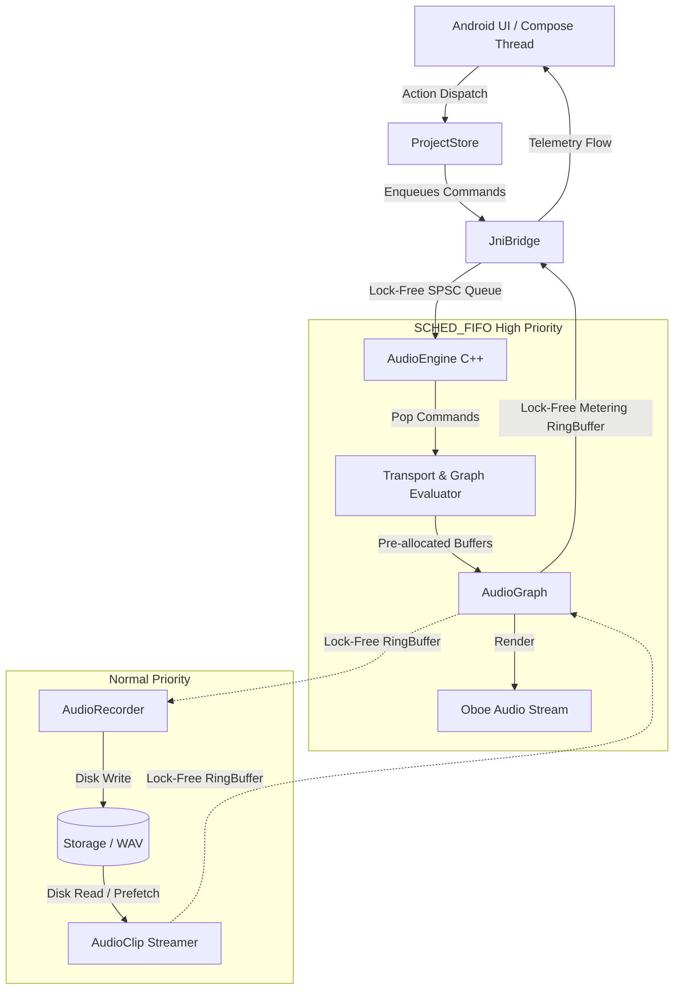

# Implementation Plan: Modular NDK-Based DAW Architecture (DSP-Reviewed)

This document presents the **comprehensive, production-grade architectural plan** reviewed from the perspective of an expert real-time audio DSP engineer. It maps out **every class, interface, inheritance structure, and concurrency guarantee** required to build the 22 functional areas defined in `SPEC01.md`.

---

## DSP Expert Architectural Review & Strict Real-Time Invariants

### 1. Real-Time Audio Thread Invariants ("The Golden Rules")
The real-time audio thread executing Oboe's `onAudioReady()` callback runs with Android `SCHED_FIFO` (real-time priority). To guarantee **zero dropouts (xruns) and sub-10ms latency**, the C++ audio path strictly enforces:
- **Zero Heap Allocations:** No `new`, `malloc`, `free`, `delete`, `std::vector::resize()`, `std::string`, `std::function`, or dynamic containers inside `process()`. All buffers, delay lines, and node capacities are allocated during initialization (`prepare()`).
- **Zero Locks / Mutexes:** No `std::mutex`, `pthread_mutex`, `std::condition_variable`, or `synchronized` blocks in the audio thread to prevent priority inversion.
- **Zero System Calls & Blocking I/O:** File reads/writes, logging (`__android_log_print`), disk streaming, and network calls execute exclusively on background worker threads via lock-free ring buffers.
- **Denormal / Subnormal Protection:** Enable **FTZ (Flush-to-Zero)** and **DAZ (Denormals-are-Zero)** via the ARM `FPSCR` control register (`ScopedNoDenormals`) to prevent 100x CPU spikes during IIR filter and reverb decay tails.
- **ARM NEON SIMD Vectorization:** All buffer mixing, gain scaling, biquad filtering, and wavetable interpolation kernels are written for auto-vectorization or explicit NEON intrinsics (`arm_neon.h`).
- **Parameter Smoothing:** All parameters (volume, pan, cutoff, sends) use linear or exponential one-pole smoothing (`SmoothedValue<float>`) to prevent zipper noise and clicks.

---

## Concurrency & Threading Model

---

## 1. Full Class Diagram: Native Audio Engine (C++)

```mermaid
classDiagram
    %% ========================================================
    %% CORE ENGINE & REAL-TIME INFRASTRUCTURE
    %% ========================================================
    class AudioEngine {
        -OboeAudioStream stream
        -LockFreeSPSCQueue~EngineCommand, 1024~ commandQueue
        -LockFreeSPSCQueue~MeterFrame, 128~ meterQueue
        -AudioGraph audioGraph
        -TransportEngine transport
        -AudioBufferPool bufferPool
        +start() Result
        +stop()
        +onAudioReady(oboeStream, audioData, numFrames) DataCallbackResult
        +sendCommand(EngineCommand cmd) bool
        +readMeters(MeterFrame* dest, int maxFrames) int
    }

    class AudioBufferPool {
        -float** preallocatedScratchBuffers
        -int bufferCount
        -int maxBlockSize
        +allocateScratch(int channelCount) float**
        +releaseScratch(float** buffer)
    }

    class ProcessContext {
        +float** inputs
        +float** outputs
        +int numChannels
        +int numFrames
        +double sampleRate
        +double currentBeat
        +double samplePosition
        +bool isPlaying
        +bool isRecording
        +AudioBufferPool* pool
    }

    class ScopedNoDenormals {
        -uint32_t savedFpscr
        +ScopedNoDenormals()
        +~ScopedNoDenormals()
    }

    class SmoothedValue~T~ {
        -T currentValue
        -T targetValue
        -T stepIncrement
        -int remainingSteps
        +setTarget(T value, int rampFrames)
        +getNext() T
        +isSmoothing() bool
    }

    %% ========================================================
    %% GRAPH & ROUTING
    %% ========================================================
    class AudioGraph {
        -TrackNode* masterTrack
        -TrackNode tracks[64]
        -int activeTrackCount
        -RoutingMatrix matrix
        +prepare(double sampleRate, int maxBlockSize)
        +process(ProcessContext ctx)
        +addTrack(TrackType type) TrackNode*
        +removeTrack(int trackIndex)
    }

    class RoutingMatrix {
        -float sendLevels[64][8]
        -int sidechainRoutes[64]
        +setSend(int srcTrack, int returnTrack, float level)
        +setSidechain(int srcTrack, int destTrack)
    }

    %% ========================================================
    %% AUDIO NODE HIERARCHY
    %% ========================================================
    class AudioNode {
        <<Abstract>>
        +int id
        +bool isEnabled
        +prepare(double sampleRate, int maxBlockSize)*
        +process(ProcessContext ctx)*
        +reset()*
    }

    class TrackNode {
        -TrackType type
        -DeviceChain deviceChain
        -PlaybackEngine* playbackEngine
        -SmoothedValue~float~ volumeFader
        -SmoothedValue~float~ panFader
        -bool isMuted
        -bool isSoloed
        -bool isArmed
        -MeteringNode meter
        +process(ProcessContext ctx)
    }

    class GroupTrackNode {
        -int childTrackIndices[16]
        -int childCount
        +process(ProcessContext ctx)
    }

    class ReturnTrackNode {
        -DeviceChain effectChain
        +process(ProcessContext ctx)
    }

    class MasterNode {
        -DeviceChain masteringChain
        -LimiterNode finalLimiter
        +process(ProcessContext ctx)
    }

    %% ========================================================
    %% DEVICE & PROCESSOR HIERARCHY
    %% ========================================================
    class DeviceNode {
        <<Abstract>>
        +bool isBypassed
        +receiveMidi(MidiMessage msg)*
    }

    class DeviceChain {
        -DeviceNode* devices[16]
        -int deviceCount
        +prepare(double sampleRate, int maxBlockSize)
        +process(ProcessContext ctx)
        +addDevice(DeviceNode* device)
        +removeDevice(int index)
    }

    class InstrumentNode {
        <<Abstract>>
        +int polyphony
        +noteOn(int note, float velocity)*
        +noteOff(int note)*
        +allNotesOff()*
    }

    class EffectNode {
        <<Abstract>>
        +SmoothedValue~float~ dryWetMix
    }

    %% Specific Instruments
    class SubtractiveSynth {
        -PolyVoice voices[16]
        -MoogLadderFilter filter
        -ADSREnvelope ampEnv
        -ADSREnvelope modEnv
    }

    class WavetableSynth {
        -WavetableOscillator wtOsc[16]
        -float* wavetableData
        -int tableSize
        -SmoothedValue~float~ tablePosition
    }

    class FMSynth {
        -FMOperator operators[4]
        -int algorithmIndex
    }

    class DrumRackNode {
        -SamplerVoice padVoices[16]
        -int chokeGroups[16]
        +triggerPad(int padIndex, float velocity)
    }

    class AdvancedSamplerNode {
        -AudioSampleBuffer sampleBuffer
        -int rootNote
        -int loopStart
        -int loopEnd
        -LoopMode loopMode
        -TimeStretcher* stretcher
    }

    %% Specific Effects
    class ParametricEQNode {
        -BiquadFilter bands[5]
        +setBand(int index, FilterType type, float freq, float q, float gainDb)
    }

    class CompressorNode {
        -float thresholdDb
        -float ratio
        -float attackMs
        -float releaseMs
        -float envelopeDb
        -float sidechainBuffer[512]
    }

    class ReverbNode {
        -CombFilter combFilters[8]
        -AllpassFilter allpassFilters[4]
        -float roomSize
        -float damping
    }

    class DelayNode {
        -float* delayBufferL
        -float* delayBufferR
        -int writeIndex
        -SmoothedValue~float~ delayTimeSamples
        -float feedback
    }

    class LimiterNode {
        -float lookaheadBuffer[256]
        -float peakHold
        -float ceilingDb
    }

    class MeteringNode {
        -float peakL
        -float peakR
        -float rmsL
        -float rmsR
        +getMeterFrame() MeterFrame
    }

    %% ========================================================
    %% SEQUENCER & PLAYBACK
    %% ========================================================
    class TransportEngine {
        -double currentSample
        -double currentBeat
        -float bpm
        -int timeSigNum
        -int timeSigDen
        -bool isPlaying
        -bool isRecording
        -bool isLooping
        -double loopStartBeat
        -double loopEndBeat
        -Metronome metronome
        +advance(int numFrames, double sampleRate)
        +seekToBeat(double beat)
    }

    class PlaybackEngine {
        <<Abstract>>
        +evaluate(double startBeat, double endBeat, TrackNode* track)*
    }

    class ArrangementEngine {
        -ArrangementClip clips[128]
        -int clipCount
        +evaluate(double startBeat, double endBeat, TrackNode* track)
    }

    class SessionEngine {
        -SessionClip slotMatrix[64][16]
        -int queuedClip[64]
        -LaunchQuantization quantization
        +launchClip(int track, int slot)
        +launchScene(int sceneIndex)
    }

    class AutomationEngine {
        -AutomationLane lanes[64]
        -int laneCount
        +evaluateBlock(double startBeat, double endBeat, int numFrames)
    }

    %% ========================================================
    %% RECORDING & OFFLINE DSP
    %% ========================================================
    class AudioRecorder {
        -LockFreeRingBuffer~float, 65536~ recordRingBuffer
        -FileWriterThread writerThread
        +startRecording(int trackId, string filePath)
        +pushAudio(float** buffer, int numFrames)
        +stopRecording()
    }

    class MidiRecorder {
        -MidiEvent recordedEvents[4096]
        -int eventCount
        +recordEvent(MidiMessage msg, double beat)
    }

    class OfflineRenderer {
        -AudioGraph graph
        +renderToFile(string outputPath, ExportFormat format, double durationBeats)
    }

    %% Relationships
    AudioEngine *-- AudioGraph
    AudioEngine *-- TransportEngine
    AudioEngine *-- AudioBufferPool
    AudioEngine *-- AudioRecorder
    AudioGraph *-- RoutingMatrix
    AudioGraph *-- TrackNode
    AudioNode <|-- TrackNode
    AudioNode <|-- GroupTrackNode
    AudioNode <|-- ReturnTrackNode
    AudioNode <|-- MasterNode
    TrackNode *-- DeviceChain
    TrackNode *-- PlaybackEngine
    TrackNode *-- MeteringNode
    DeviceChain *-- DeviceNode
    DeviceNode <|-- InstrumentNode
    DeviceNode <|-- EffectNode
    InstrumentNode <|-- SubtractiveSynth
    InstrumentNode <|-- WavetableSynth
    InstrumentNode <|-- FMSynth
    InstrumentNode <|-- DrumRackNode
    InstrumentNode <|-- AdvancedSamplerNode
    EffectNode <|-- ParametricEQNode
    EffectNode <|-- CompressorNode
    EffectNode <|-- ReverbNode
    EffectNode <|-- DelayNode
    EffectNode <|-- LimiterNode
    PlaybackEngine <|-- ArrangementEngine
    PlaybackEngine <|-- SessionEngine
    TransportEngine *-- AutomationEngine
```

---

## 2. Full Class Diagram: Kotlin Application Layer (No ViewModels)

The Kotlin layer is strictly modularized into **Domain Repositories**, a **Centralized Project Store (UDF)**, **Lightweight UI State Holders**, and a **JNI Command Serializer**.

```mermaid
classDiagram
    %% ========================================================
    %% DATA & STORAGE LAYER
    %% ========================================================
    class DawDatabase {
        +projectDao() ProjectDao
    }

    class ProjectDao {
        <<Interface>>
        +getProjects() Flow~List~ProjectEntity~~
        +insertProject(ProjectEntity p)
        +deleteProject(long id)
    }

    class ProjectManager {
        -DawDatabase db
        -ProjectArchiveService archiver
        -AutosaveScheduler autosave
        +createProject(String name, ProjectTemplate template)
        +loadProject(Long id)
        +saveProject(ProjectState state)
        +exportStemsZip(List~String~ trackIds, File dest)
    }

    %% ========================================================
    %% STORE & JNI BRIDGE (UNIDIRECTIONAL DATA FLOW)
    %% ========================================================
    class ProjectStore {
        -MutableStateFlow~ProjectState~ _state
        +StateFlow~ProjectState~ state
        -NativeAudioBridge nativeBridge
        +dispatch(ProjectAction action)
    }

    class NativeAudioBridge {
        <<Singleton>>
        +initEngine(int sampleRate, int bufferSize)
        +startEngine()
        +stopEngine()
        +dispatchCommand(int commandId, ByteArray payload)
        +pollMeterData(FloatArray dest) int
    }

    %% ========================================================
    %% MODULAR UI STATE HOLDERS (RETAINED IN COMPOSE, NO VIEWMODEL)
    %% ========================================================
    class BaseStateHolder~T~ {
        <<Abstract>>
        #ProjectStore store
        +StateFlow~T~ uiState
    }

    class TransportStateHolder {
        +StateFlow~TransportUiState~ state
        +play()
        +pause()
        +stop()
        +setBpm(float bpm)
        +toggleMetronome()
        +toggleLoop()
    }

    class ArrangementStateHolder {
        +StateFlow~ArrangementUiState~ state
        +moveClip(String clipId, String targetTrackId, double targetBeat)
        +splitClip(String clipId, double splitBeat)
        +resizeClip(String clipId, double newLengthBeats)
        +setLoopRegion(double startBeat, double endBeat)
    }

    class SessionStateHolder {
        +StateFlow~SessionUiState~ state
        +launchClip(String trackId, int slotIndex)
        +launchScene(int sceneIndex)
        +recordIntoSlot(String trackId, int slotIndex)
        +stopTrack(String trackId)
    }

    class MixerStateHolder {
        +StateFlow~MixerUiState~ state
        +setVolume(String trackId, float volumeDb)
        +setPan(String trackId, float pan)
        +toggleMute(String trackId)
        +toggleSolo(String trackId)
        +toggleArm(String trackId)
    }

    class DeviceRackStateHolder {
        +StateFlow~DeviceRackUiState~ state
        +addDevice(String trackId, DeviceType type)
        +removeDevice(String trackId, String deviceId)
        +reorderDevices(String trackId, int fromIndex, int toIndex)
        +updateParam(String deviceId, int paramIndex, float normalizedValue)
    }

    class PianoRollStateHolder {
        +StateFlow~PianoRollUiState~ state
        +addNote(MidiNote note)
        +deleteNote(String noteId)
        +quantizeNotes(QuantizeGrid grid)
        +transposeNotes(int semitones)
    }

    class SoundBrowserStateHolder {
        +StateFlow~BrowserUiState~ state
        +search(String query)
        +filterByCategory(BrowserCategory cat)
        +previewSample(String samplePath)
        +loadSampleToPad(String samplePath, int padIndex)
    }

    %% ========================================================
    %% IMMUTABLE STATE DATA MODELS
    %% ========================================================
    class ProjectState {
        <<Data Class>>
        +String id
        +String name
        +float bpm
        +int timeSigNum
        +int timeSigDen
        +List~TrackModel~ tracks
        +List~SceneModel~ scenes
        +MasterTrackModel masterTrack
    }

    class TrackModel {
        <<Data Class>>
        +String id
        +String name
        +TrackType type
        +float volumeDb
        +float pan
        +bool isMuted
        +bool isSoloed
        +bool isArmed
        +List~DeviceModel~ devices
        +List~ClipModel~ arrangementClips
        +List~ClipModel~ sessionClips
    }

    %% Relationships
    ProjectManager --> DawDatabase
    ProjectManager --> ProjectStore
    ProjectStore --> NativeAudioBridge
    ProjectStore *-- ProjectState
    ProjectState *-- TrackModel
    
    BaseStateHolder <|-- TransportStateHolder
    BaseStateHolder <|-- ArrangementStateHolder
    BaseStateHolder <|-- SessionStateHolder
    BaseStateHolder <|-- MixerStateHolder
    BaseStateHolder <|-- DeviceRackStateHolder
    BaseStateHolder <|-- PianoRollStateHolder
    BaseStateHolder <|-- SoundBrowserStateHolder
    BaseStateHolder --> ProjectStore
```

---

## Architectural Mapping Against All 22 Spec Areas

| Spec Area | Native Engine (C++) Component | Kotlin State / UI Component |
| :--- | :--- | :--- |
| **1. Project System** | `OfflineRenderer`, binary state unpacker | `ProjectManager`, `DawDatabase`, `ProjectStore` |
| **2. Transport Controls** | `TransportEngine`, `Metronome` | `TransportStateHolder` |
| **3. Arrangement View** | `ArrangementEngine`, `AudioClipPlayer` | `ArrangementStateHolder` |
| **4. Session View** | `SessionEngine`, quantized launcher | `SessionStateHolder` |
| **5. Track System** | `AudioGraph`, `TrackNode`, `GroupTrackNode` | `TrackModel`, `MixerStateHolder` |
| **6. Audio Recording** | `AudioRecorder` (lock-free disk streamer) | `RecordingController`, input monitor UI |
| **7. MIDI Recording & Edit** | `MidiEngine`, `MidiRecorder` | `PianoRollStateHolder`, MIDI controller manager |
| **8. Audio Clip Editor** | Offline DSP kernels (stretch, pitch, fade) | `AudioClipEditorStateHolder` |
| **9. Drum Rack** | `DrumRackNode`, pad choke group matrix | `DrumPadGridStateHolder` |
| **10. Sampler** | `AdvancedSamplerNode`, transient slicer | `SamplerInstrumentStateHolder` |
| **11. Instruments** | `SubtractiveSynth`, `WavetableSynth`, `FMSynth` | `DeviceRackStateHolder`, synth UI panels |
| **12. Browser & Library** | Sample pre-decoder, asset preview stream | `SoundBrowserStateHolder`, sound pack installer |
| **13. Device Chains** | `DeviceChain`, parallel routing nodes | `DeviceRackStateHolder`, macro control UI |
| **14. Mixer** | `RoutingMatrix`, `VolumePanNode`, sends/returns | `MixerStateHolder`, faders/meters UI |
| **15. Effects** | `ParametricEQNode`, `CompressorNode`, `ReverbNode`, etc. | Effect parameters UI |
| **16. Routing** | `RoutingMatrix` (DAG sidechains, sends) | Routing configuration UI |
| **17. Automation** | `AutomationEngine`, sample-accurate smoothing | `AutomationLaneStateHolder` |
| **18. Performance Functions** | Clip matrix trigger, momentary effects | `SessionStateHolder`, Pad macro UI |
| **19. Mixing & Mastering** | `MasterNode`, `LimiterNode`, `MeteringNode` | Master bus channel UI |
| **20. Export & Sharing** | `OfflineRenderer` (multi-threaded stem bounce) | Export dialog & sharing intent |
| **21. Hardware & Connectivity** | Oboe low-latency stream, USB/BLE MIDI driver | Audio device selector, MIDI learn map |
| **22. Reliability & Protection** | FTZ/DAZ denormal protection, crash-safe ring buffer | `AutosaveScheduler`, crash recovery flow |

---

## Verification & Strict Quality Standards

### Automated Tests
- **C++ GoogleTest DSP Tests:**
  - Mathematical frequency response validation for all 5 EQ biquad filter topologies.
  - Zero-allocation validation using custom global `new`/`malloc` instrumentation traps during `process()` blocks.
  - SPSC queue stress tests across 10,000,000 iterations without a single dropped or corrupted message.
- **Kotlin Unit Tests:**
  - `ProjectStore` state transition verification for all `ProjectAction` types.
  - Non-blocking state holder flows under high-frequency updates (e.g., 60fps playhead polling).

### Quality Benchmarks
- **Audio Latency:** Sub-10ms roundtrip audio latency on ProAudio-certified devices using `Oboe::SharingMode::Exclusive`.
- **CPU Overhead:** Under 15% CPU utilization on mid-range ARM64 hardware for a 16-track project playing multiple polyphonic synths and reverbs simultaneously.
