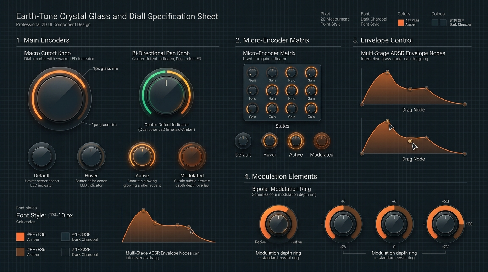
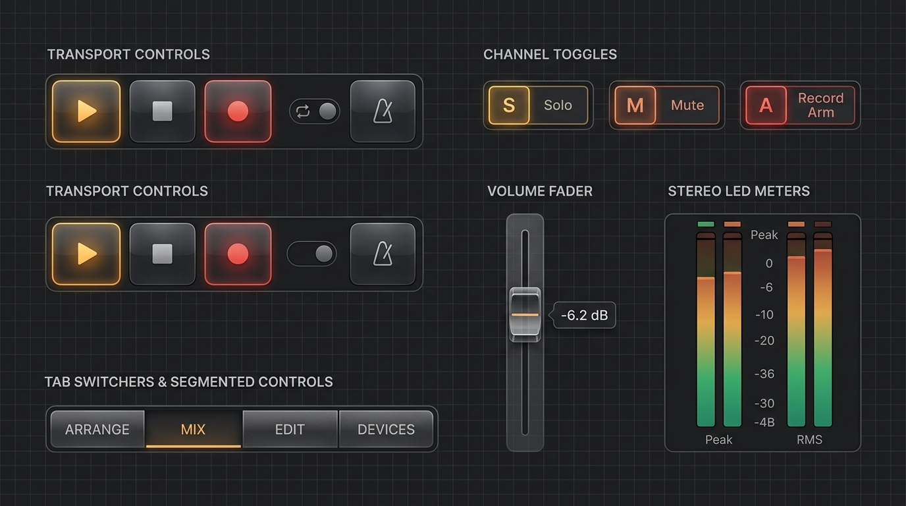
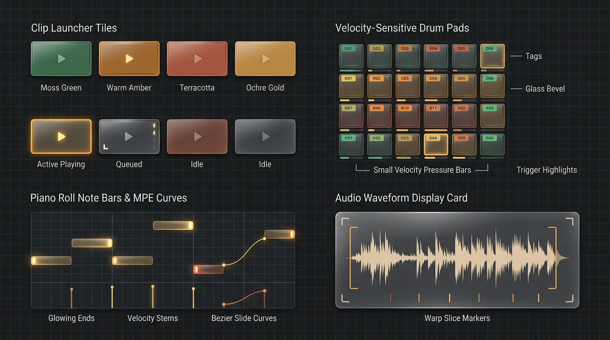

# Earth.Design — Next-Gen Crystal Glass DAW Design System

> **Mandatory Visual Standard: Earth-Tones Crystal Glassmorphism Only**  
> High-Class Crystal Glassmorphism with an Earth-Tone Palette & Bitwig Ergonomics  
> Designed for the Next-Generation Standalone Mobile & Desktop DAW.

---

## Table of Contents

1. [System Overview & Philosophy](#system-overview--philosophy)
2. [Visual Architecture & Design Tokens](file:///c:/Users/tessi/antigravity/Dawsome-mobile2/docs/spec/Earth.Design/FOUNDATIONS.md)
3. [Pro-Audio UI Component Suite](file:///c:/Users/tessi/antigravity/Dawsome-mobile2/docs/spec/Earth.Design/COMPONENTS.md)
4. [Master Screen Specifications](file:///c:/Users/tessi/antigravity/Dawsome-mobile2/docs/spec/Earth.Design/SCREENS.md)
5. [Machine-Readable Design Tokens (`TOKENS.json`)](file:///c:/Users/tessi/antigravity/Dawsome-mobile2/docs/spec/Earth.Design/TOKENS.json)
6. [Kotlin Jetpack Compose Implementation](file:///c:/Users/tessi/antigravity/Dawsome-mobile2/docs/spec/Earth.Design/tokens/)

---

## 1. System Overview & Philosophy

The **Earth.Design** system establishes a luxurious, modern visual identity that bridges high-class crystal glassmorphism with maximum information density and pro-audio precision ergonomics.

### Core Tenets

- **Cohesive Earth Tones**: Anchored by warm Bitwig amber (`#FF7600`), terracotta / burnt copper (`#C85A32`), forest emerald (`#2E7D4E`), moss sage (`#6B8E23`), and ochre gold (`#D4AF37`) over deep warm charcoal espresso crystal glass (`#141210`).
- **Crystal Glass Texture**: Translucent acrylic glass panels with 1px razor-sharp frosted borders (`rgba(255, 255, 255, 0.08)` to `rgba(255, 118, 0, 0.20)`), subtle light refraction, and controlled ambient rim glow.
- **Ultra-High Information Density ("Small Features")**: Designed without wasted padding. Micro-encoders, tight 1px glass card containers, multi-track timeline visibility, and compact modular device chains ensure desktop-depth workflow on mobile and tablet displays.
- **Strict Bitwig Ergonomics**: Familiar, muscle-memory-friendly placement of transport controls, project tabs, clip launcher matrices, arranger timelines, and footer view switchers.

---

## 2. Component Reference Visuals

### Rotary Encoders & Modulation Dials


### Transport, Faders, Toggles & Level Meters


### Clip Launcher Tiles, Drum Pads & Waveforms


---

## 3. Directory Structure

```
docs/spec/Earth.Design/
├── README.md               # Master system index (this file)
├── FOUNDATIONS.md          # Color palette, typography, glass elevation & density tokens
├── COMPONENTS.md           # Detailed UI component specs (Knobs, Faders, Pads, Clips)
├── SCREENS.md              # 9 Full visual screen mockups with workflow specs
├── TOKENS.json             # Cross-platform machine-readable design tokens
├── tokens/
│   ├── ColorTokens.kt      # Compose Color definitions
│   ├── GlassTokens.kt      # Compose Glassmorphism modifiers & border shaders
│   ├── TypeTokens.kt       # Compose Typography definitions (Inter / Outfit)
│   └── EarthTheme.kt       # Compose Material3 Theme & CompositionLocals
└── assets/                 # High-resolution component sheets & screen mockups
```
