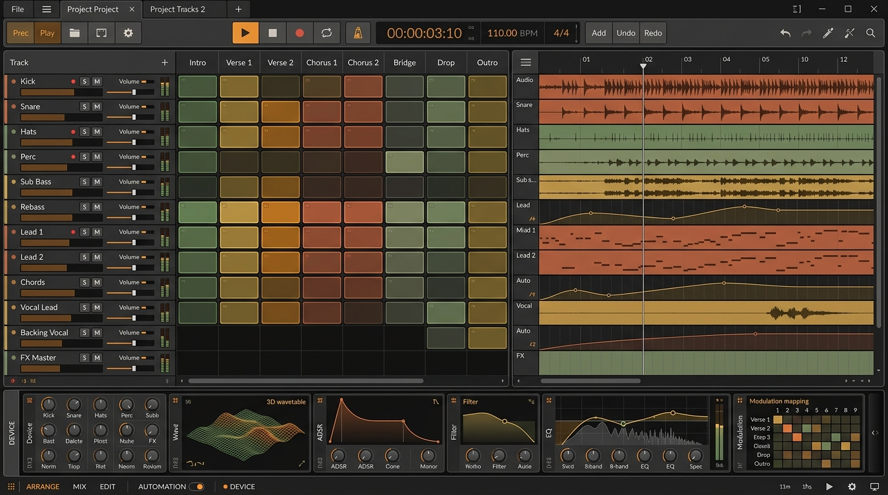
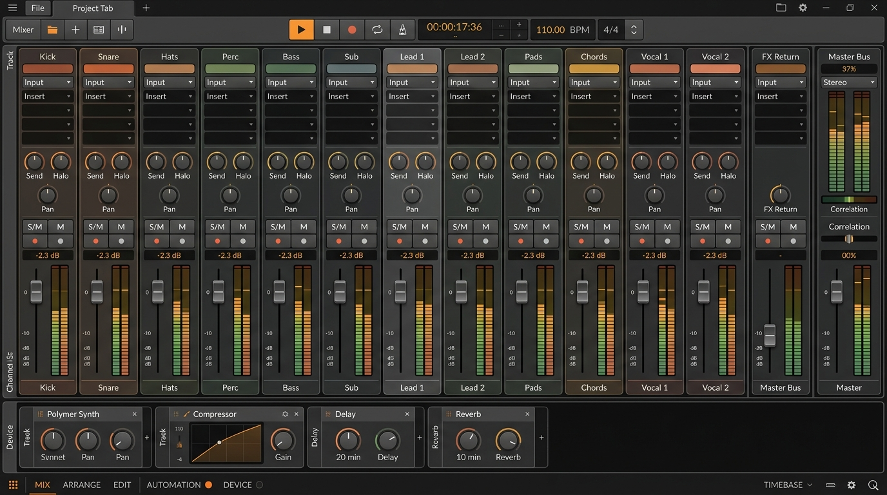
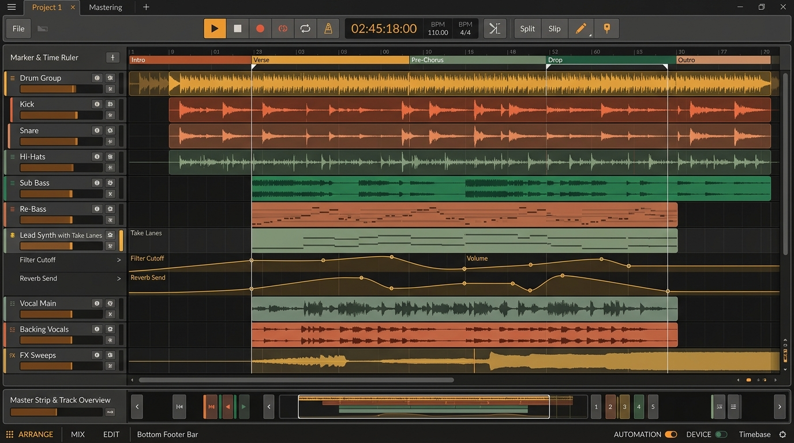
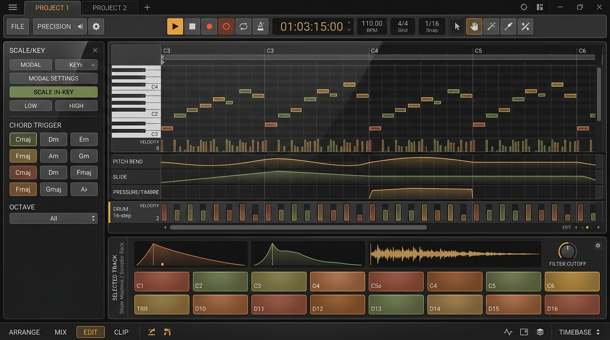
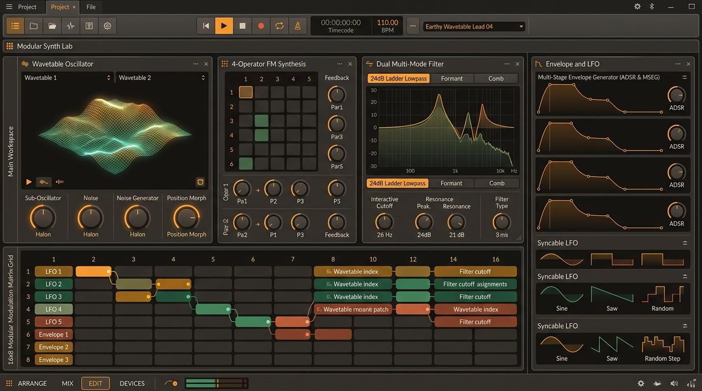
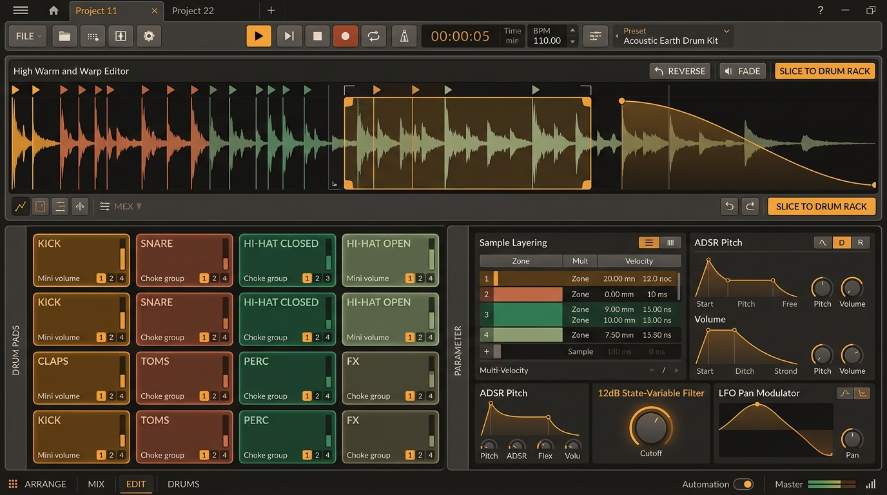
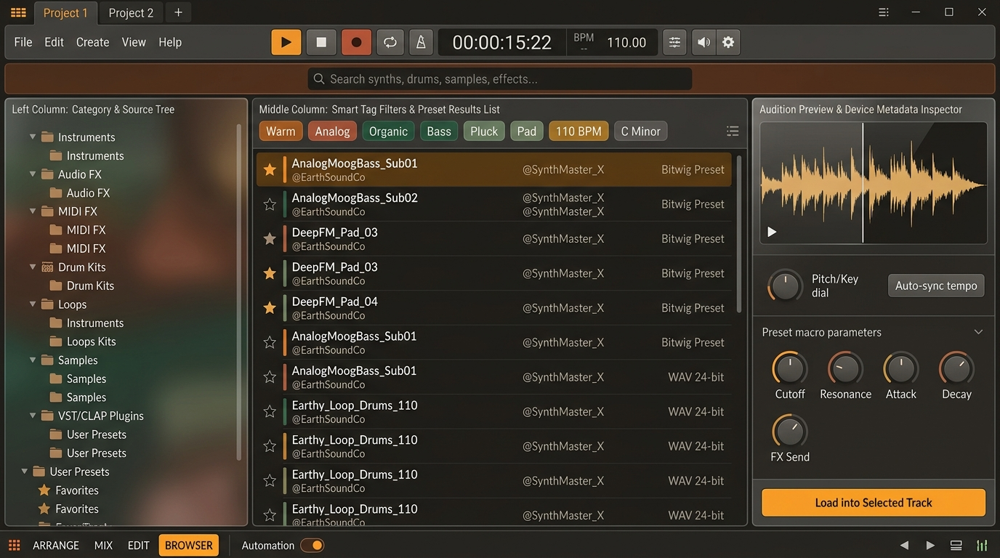
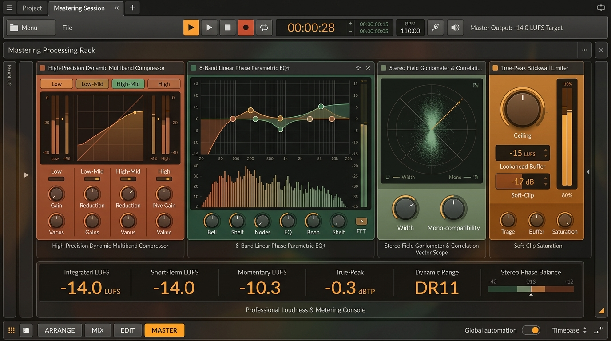
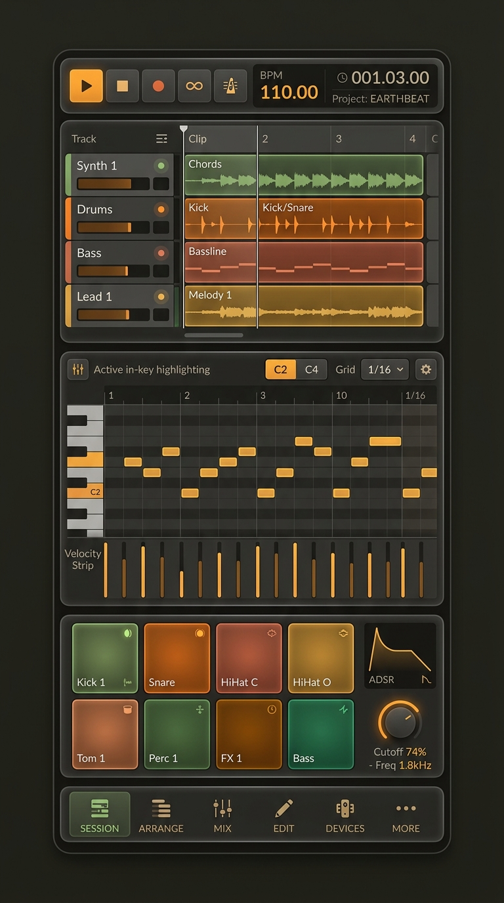

# Earth.Design — Master Screen Specifications

> **Complete visual directory of every main view in the DAW, rendered in our Earth-Tone Crystal Glass design system.**

---

## Screen Directory

1. [Main Integrated Workspace (Session + Arranger + Polymer Synth)](#1-main-integrated-workspace)
2. [Mixer Console & Channel Strip View](#2-mixer-console--channel-strip-view)
3. [Full Arranger Timeline View](#3-full-arranger-timeline-view)
4. [Detail Note & Piano Roll Editor](#4-detail-note--piano-roll-editor)
5. [Modular Synthesizer & Sound Design Lab](#5-modular-synthesizer--sound-design-lab)
6. [Sampler & Drum Machine Lab](#6-sampler--drum-machine-lab)
7. [Sound Browser & Preset Management Suite](#7-sound-browser--preset-management-suite)
8. [Mastering Suite & FX Grid](#8-mastering-suite--fx-grid)
9. [Mobile Smartphone Portrait View](#9-mobile-smartphone-portrait-view)

---

### 1. Main Integrated Workspace
*The central command hub connecting the Clip Launcher, multi-track Arranger timeline, and bottom modular device rack.*

- **Top**: Project tabs, File menu, Transport controls (Amber Play, Stop, Rec, Loop, Metronome), Timecode `00:00:03:10`, `110.00 BPM`, `4/4`.
- **Center**: Left Track headers (12 tracks), Center-Left 8-column Clip Launcher grid (Intro through Outro), Center-Right Arranger timeline with waveforms, MIDI blocks, and automation curves.
- **Bottom**: Modular Polymer Synth, 3D Wavetable, ADSR Envelope, Multi-mode Filter, 8-band Parametric EQ+, and Modulation Mapping matrix.

---

### 2. Mixer Console & Channel Strip View
*High-density mixing desk with 14 precision channel strips, sends, inserts, and master monitoring.*

- **Channel Strips**: 14 vertical translucent crystal glass strips with color tags, input selector, 4 insert slots, dual send dials with amber/moss halos, pan knobs, Solo/Mute/Arm toggles, long precision faders, and stereo LED peak meters.
- **Master Section**: Master Bus strip with correlation meter and stereo loudness monitoring.
- **Bottom**: Selected track audio effect rack (Polymer Synth, Compressor with reduction curve, Delay, Reverb).

---

### 3. Full Arranger Timeline View
*Deep timeline view for song arrangement, multi-take recording, and multi-parameter automation.*

- **Top Marker & Ruler**: Intro, Verse, Pre-Chorus, Drop, Outro section markers with loop brackets.
- **Track Lanes**: 12 lanes with crossfades, take lanes, and expanded multi-node bezier automation curves for Filter Cutoff, Volume, and Reverb Send.
- **Bottom**: Compact Master strip and timeline overview navigator.

---

### 4. Detail Note & Piano Roll Editor
*High-precision MIDI note sequencing, MPE multi-dimensional expression editing, and drum programming.*

- **Left**: Scale & Key selector (`C Harmonic Minor`, Scale In-Key fold filter), chord trigger pads, and octave selector.
- **Center**: Multi-octave Piano Roll with translucent crystal note blocks, velocity stems, and continuous MPE curves (Pitch Bend, Slide, Pressure/Timbre).
- **Bottom**: Selected track Drum Machine / Sampler rack with 16 crystal drum pads and filter cutoff control.

---

### 5. Modular Synthesizer & Sound Design Lab
*Complete sound design environment for wavetable morphing, 4-operator FM, multi-mode filtering, and modular modulation routing.*

- **Left**: Dual Wavetable Oscillators with 3D holographic terrain visualizer and morph encoders.
- **Center**: 4-Operator FM synthesis matrix, Dual 24dB ladder lowpass/formant/comb filter graph.
- **Right**: 4 Multi-stage ADSR & MSEG envelopes with 3 syncable LFO modulators.
- **Bottom**: 16×8 Modular Modulation Matrix grid with color-coded drag assignments.

---

### 6. Sampler & Drum Machine Lab
*Audio slicing, transient detection, warping, and 16-pad drum performance lab.*

- **Upper**: High-resolution audio waveform editor with transient slice markers, warp markers, loop brackets, pitch envelopes, and `SLICE TO DRUM RACK` button.
- **Lower**: 16 velocity-sensitive crystal drum pads in 4x4 grid with choke groups (1-4), multi-velocity layer inspector, ADSR pitch/volume envelopes, and state-variable filter.

---

### 7. Sound Browser & Preset Management Suite
*Fast, tag-based sound discovery with instant tempo/key-synced auditioning.*

- **Left**: Hierarchical source tree (Instruments, Audio FX, MIDI FX, Drum Kits, Loops, Samples, Plugins, Favorites).
- **Middle**: Multi-tag filter chips (`Warm`, `Analog`, `Organic`, `Bass`, `Pluck`, `110 BPM`) and searchable results list.
- **Right**: Audition preview player with live waveform, pitch transpose dial, auto-sync tempo toggle, preset macro knobs, and `Load into Selected Track` action button.

---

### 8. Mastering Suite & FX Grid
*Comprehensive finalization and mastering rack with true-peak limiting, linear-phase EQ, and EBU R128 loudness analysis.*

- **Mastering Chain**: 4-Band Dynamic Multiband Compressor, 8-Band Linear Phase Parametric EQ+, Stereo Field Goniometer & Correlation Vector Scope, True-Peak Brickwall Limiter.
- **Loudness Console**: Integrated LUFS (`-14.0 LUFS`), Short-Term LUFS, Momentary LUFS, True-Peak (`-0.3 dBTP`), Dynamic Range (`DR11`), and Stereo Phase Balance meter.

---

### 9. Mobile Smartphone Portrait View
*Adapting the full standalone DAW depth to vertical phone screens without compromising functionality.*

- **Top**: Compact mobile transport bar with play, record, loop, BPM 110.00, and timecode.
- **Upper**: 4-Track vertical scene matrix and mini waveform overview.
- **Middle**: Touch-optimized Piano Roll with active in-key highlighting and velocity strips.
- **Lower**: 8 Velocity drum pads in warm earth tones, mini ADSR, and filter cutoff knob.
- **Dock**: Floating crystal glass navigation bar (`SESSION`, `ARRANGE`, `MIX`, `EDIT`, `DEVICES`, `MORE`).
